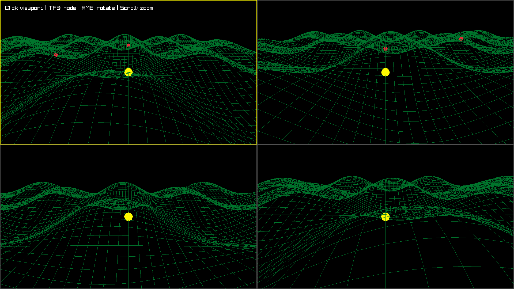

[](assets/hill_cllimbing.mp4)
# HillExplorer

A 3D hill climbing algorithm visualization built with C++17 and raylib.

## Overview

HillExplorer demonstrates the hill climbing optimization algorithm in an interactive 3D environment. The simulation visualizes agents navigating terrain to find local maxima using the hill climbing strategy.

**Features:**
- 3D terrain generation using mathematical functions
- Multiple agents performing hill climbing simultaneously
- Split-screen camera views for different perspectives
- Smooth camera controls and real-time visualization

## Prerequisites

### Linux Dependencies

Before building, install the required raylib dependencies:

```bash
sudo apt-get update
sudo apt-get install -y libgl1-mesa-dev libxi-dev libx11-dev libxrandr-dev libxinerama1 libxinerama-dev libxcursor-dev libxss-dev libglfw3 libglfw3-dev
```

## Getting Started

### Clone the Repository

Make sure to clone with submodules to include raylib:

**HTTPS:**
```bash
git clone --recursive https://github.com/Avel-Dev/hill_climbing-.git
cd hill_climbing-
```

**SSH (Linux):**
```bash
git clone --recursive git@github.com:Avel-Dev/hill_climbing-.git
cd hill_climbing-
```

**If you already cloned without submodules:**
```bash
git submodule update --init --recursive
```

## Building

This project uses CMake (minimum version 3.30) and C++17.

```bash
# Create build directory
mkdir -p build
cd build

# Configure
cmake ..

# Build
cmake --build .
```

## Running

After building, run the executable from the project root:

```bash
./build/HillExplorer
```

## Project Structure

```
hill_climbing-/
├── CMakeLists.txt      # CMake configuration
├── main.cpp            # Main source file
├── README.md           # This file
├── LICENSE             # Project license
├── assets/             # Asset files (textures, models, etc.)
├── raylib/             # raylib submodule (git submodule)
└── build/              # Build output directory
```

## Notes About Submodules

This project includes [raylib](https://github.com/raysan5/raylib) as a Git submodule. The raylib library is automatically built as part of the CMake configuration.

**To update the raylib submodule to the latest version:**
```bash
cd raylib
git pull origin master
cd ..
git add raylib
git commit -m "Update raylib submodule"
```

**If raylib is missing after cloning:**
```bash
git submodule update --init --recursive
```

## Controls

- **WASD / Arrow Keys**: Move camera
- **Mouse**: Look around
- **Scroll**: Zoom in/out

## License

This project is licensed under the terms found in the [LICENSE](LICENSE) file.
